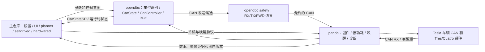

# dev 四月以来完整功能迁移方案

## 1. 结论和方向

以 `moumou758/openpilot:sp260728XL-tici` 的主仓库架构、目录布局、依赖、cereal 和构建体系为基础，保留 `onemiless/sp:dev` 从 2026 年 4 月以来的全部最终功能行为。

主仓库、opendbc 和 panda 采用同一原则：

- 新架构是实现基础。
- `dev` 是功能规格、CAN 样本、安全边界和回归测试的事实来源。
- 保留的是功能，不是旧文件、旧 API 或旧提交历史。
- 如果旧代码不适合新架构，就在新架构上重新实现。
- 参数、cereal 字段、safety flag 只作为具体功能的内部接口迁移，不立独成为基础设施项目。
- opendbc 和 panda 不直接沿用旧 `dev` 基线，而是在目标分支对应的新基线上重建功能。

## 2. 三仓库基线

| 仓库 | dev 功能规格 | 目标新基线 | 处理方式 |
|---|---|---|---|
| 主仓库 | `onemiless/sp:dev` `f6106a8a13` | `moumou758/openpilot:sp260728XL-tici` `7de18acbac` | 保留目标目录和运行架构，按功能重建 dev 增量 |
| opendbc | `onemiless/opendbc:dev` `6e4c52e5` | 目标 gitlink `4c64e8a9` | 保留新上游车型、DBC 和 safety 架构，重建 Tesla 功能和 safety 规则 |
| panda | `onemiless/panda:dev` `29819e26` | 目标 gitlink `36b08366` 及其后续兼容上游 | 保留新固件架构，重建 Tres/Cuatro 离线唤醒功能 |

基线必须用一份三仓库锁定清单固定。主仓库每次发布必须同时记录 opendbc 和 panda 精确提交，禁止依赖未固定的子模块分支头。

### 2.1 已确认的子仓库差异规模

- opendbc 目标基线与 dev 已分叉：dev 侧有 117 个独有提交，目标侧有 91 个独有提交。
- dev opendbc 中最终 Tesla 功能主要落在 18 个车辆、DBC、sunnypilot 扩展和 safety 文件中，有效差异约 3364 行。
- panda 目标基线与 dev 已分叉：dev 侧有 66 个独有提交，目标侧有 7 个独有提交。
- dev panda 的最终离线唤醒行为主要落在 22 个固件、Python API 和测试文件中，有效差异约 1763 行。
- 这些提交包含大量试验、回退和中间状态，不能整段 cherry-pick，只能以最终行为和最终测试为准。
- 作者和路径防漏审计显示：opendbc 的自研增量全部归入 Tesla 控制、DBC、safety、MADS/MPC 接口；panda 的 66 个 dev 独有提交全部归入离线唤醒、bootkick、STOP 和诊断链。未发现本方案之外的第四类子仓库特有功能。

## 3. 跨仓库功能架构

任何 Tesla 控制功能只有在下列四个环节同时闭环时才算完成：

1. 主仓库能正确配置功能并生成控制意图。
2. opendbc 能从真实 CAN 状态产生正确状态机输出。
3. opendbc safety 只允许当前模式必要的报文，并拒绝伪造、过期、超频和越界报文。
4. panda 和实车总线不会因功能切换、休眠或唤醒而进入错误状态。

## 4. opendbc 详细重建方案

opendbc 必须以目标 `4c64e8a9` 所在的新上游为基础。不能用 dev 的整个 opendbc 覆盖目标，否则会删除目标已有的 VW MEB、新 safety API 和其他车型修复。

### O1. Tesla 车型、固件与总线拓扑

保留的功能行为：

- Model 3/Y 新固件指纹和 FSD 14 EPS 识别。
- 观测到的 Model Y 固件不能被误判为 FSD 14，旧固件保留旧转向语义。
- HW3/HW4、party/vehicle/ADAS/radar 总线拓扑和 `HAS_VEHICLE_BUS` 能力识别。
- 只在车辆指纹确认存在 vehicle bus 时建立对应 parser，避免缺失总线导致错误 CAN check。
- 禁止旧雷达自动误检测；只有指纹和 DBC 都表明雷达存在时才启用。
- HW4 perception DBC 支持道路标志、行人、盲区、前向安全、交通灯和停车线数据。

重建方式：

- 在新 opendbc 的 platform config、firmware matcher、Bus 枚举和 DBC 注册机制上实现。
- 不复制旧 platform 结构体，不撤销目标上游的车型抽象。
- 将现有真实固件和 CAN 样本固化为 matcher/parser 测试。

### O2. Tesla 纵向来源状态机

建立一个明确的最终状态机，至少区分：

- SP 纵向。
- 人工选择的原车纵向。
- Dynamic Auto Stock 选择的原车纵向。
- AP Hybrid 会话中的原车纵向。

状态机规则：

- 三指 MADS 和四指纵向切换不得混用。
- 四指只负责原车/SP 纵向手动切换，并且只在有正确 vehicle bus 时生效。
- 进入原车纵向前必须确认 OEM ACC 存在、需求匹配，不允许因切换产生突发加速。
- 进入原车时处理旧 CANCEL、计数器和 DAS_control 接管边界。
- 返回 SP 时先使用中性接管帧，再从车辆实测加速度平滑进入 SP 命令。
- 巡航仍启用时不能因接管而误 CANCEL；巡航已关闭时才允许发送取消语义。
- 手动选择后暂停动态切换，直到用户明确恢复 SP。

### O3. Dynamic Auto Stock

保留的最终行为：

- 支持可配置进入和退出速度阈值，使用滞回避免边界抖动。
- 低速/高速阈值是状态机输入，不是在高频 CAN 解析路径里反复读 Params。
- 转向灯和弯道上下文可独立配置为强制回到 SP。
- 转向灯必须是新的、连续的真实样本，不允许用 parser 缓存值反复计数。
- 弯道请求只对新鲜 planner 样本计数。
- 原车返回条件清除后至少稳定 1 秒才返回，避免来回切换。
- AP Hybrid 活动时忽略 Dynamic Auto Stock 的强制请求。

### O4. AP Hybrid 和 Dynamic AP Longitudinal

保留的最终行为：

- AP Hybrid 只在 Tesla 且 openpilot 纵向可用时开放。
- Tesla AP 会话可保持，SP 和 Tesla 分别拥有横向/纵向的可配置部分。
- Dynamic AP Longitudinal 用速度滞回在 OEM 和 SP 纵向间切换，同时验证 OEM 加速度包络和 SP 接管准备状态。
- Tesla AP 横向所有权只在设定条件满足时生效；驾驶员 override 立即让回 SP/人工优先级。
- lane-change available、AP 状态短暂抖动、aborted 中间态不能错误结束会话。
- 退出需要 3 个不同计数器的稳定样本，不能把同一 parser 缓存当成多个样本。
- 刹车退出期间仅抑制残留 OEM LKAS，真实 OEM fault 必须继续上报。
- FSD 14 使用新 steering control type 语义，旧固件保留 pre-FSD14 语义。

### O5. Tesla 自动速度调节

这是独立功能，不能用普通限速显示代替。

- 以 SP resolver 最终有效道路限速为目标。
- 在 km/h 和 mph 下都按 Tesla 仪表整数速度计算。
- 目标变化后等待 500 ms 稳定。
- 每次只发一个右滚轮上/下 tick，等待车辆反馈后再继续。
- 反馈超时 1.2 s，两次发送至少间隔 500 ms。
- 使用最近收到的原车空闲 `0x3C2 mux-1` RX 帧作为模板，超过 1.5 s 即拒绝发送。
- 人工或外部改变设定速度后立即暂停自动调节。
- 用户通过右滚轮反向组合手势恢复自动调节。
- 新限速或巡航重新接通时按 dev 最终规则清除人工覆盖。
- 原车纵向活动时仍允许调整 Tesla 巡航设定速度。

### O6. 转向灯和速度按钮验证

保留的最终行为：

- 转向灯验证只在功能开启、vehicle bus 存在、档位/车辆状态合法时生效。
- 只使用新鲜原车 RX 帧作为模板，仅修改允许的方向位和计数/校验位。
- 一次请求是有上限的 session，不能无限连续发送。
- Park 状态、模板时间、计数器和发送速率都要在 safety 里二次验证。
- 速度按钮验证模式不得意外开启正常 ICBM/纵向控制。
- 自动速度调节和手动验证共用模板安全约束，但使用不同功能授权。

### O7. 协作转向和 Tesla MADS

保留的最终行为：

- 协作转向在驾驶员施加力矩时平滑降低 SP 转向命令，不产生角度跳变。
- 覆盖结束后通过受限斜率恢复，避免立即抢回方向盘。
- 高车速、大角速率、EPS fault 和 controls not allowed 时遵守新上游的转向限制。
- MADS 屏幕按钮只在 Tesla 且 vehicle bus 存在时可配置。
- 三指保留为 MADS 语义，四指保留为纵向切换，不恢复旧的冲突实现。
- safety 中的 `controls_allowed_lateral` 与新 MADS 架构协同，不回退上游安全抽象。

### O8. Tesla safety 安全合同

opendbc safety 不是附属代码，而是 O2–O7 的完成条件。需在新 safety API 上重新实现：

- 功能配置 flag 和运行时状态 flag 分离。
- SP、manual stock、dynamic stock、AP Hybrid stock 有可区分的运行时编码。
- RX hook 只从真实车辆帧更新原车模板、巡航状态和 AP 状态。
- TX hook 根据当前纵向/横向所有者选择加速度、转向、滚轮和转向灯规则。
- FWD hook 避免 OEM 和 SP 同时发送 DAS_control，不能出现双发和 counter 冲突。
- 原车纵向模式仅允许原车回显/接管所需的边界，不得全局跳过加速度安全检查。
- FSD 14 steering control type 在 Python 和 safety 中使用相同解码规则。
- 转向灯/滚轮帧要求原车模板字节一致、模板新鲜、tick 值有限且发送频率受限。
- 未开启功能时，所有新 TX 能力默认拒绝。

### O9. opendbc 测试门槛

需保留并适配到新 API 的外部行为测试：

- 指纹、FSD 14、HW3/HW4、雷达和 vehicle bus parser 测试。
- 手动纵向、Dynamic Auto Stock、AP Hybrid 和 Dynamic AP 状态转移测试。
- 进出 OEM ACC 的加速度连续性、CANCEL、counter 和 stale sample 测试。
- 自动速度调节的单 tick、反馈、稳定时间、单位、人工覆盖和过期模板测试。
- 转向灯和速度按钮模板、会话上限和发送频率测试。
- safety RX/TX/FWD、relay malfunction、controls allowed、MADS lateral 和所有 flag 组合测试。
- 使用保留 CAN 片段做 safety replay，新分支不得比 dev 多放行报文。

## 5. panda 详细重建方案

panda 必须在目标的新上游固件架构上重建。当前 `dev-new` 直接指向旧 dev panda `29819e26`，这只能用作功能对照，不是最终架构方案。

目标 panda `36b08366` 中将 Python `get_type()` 硬编码为 Tres 的 `xl test` 不是真实硬件支持，重建前必须移除，恢复真实硬件类型检测。

### P1. Tres/Cuatro bootkick 抽象

- 在新 board abstraction 上表达 standby、bootkick assert、wake release 和 reset 状态。
- Tres 和 Cuatro 使用自己的 GPIO 极性和电源时序，不通过伪造硬件类型共用代码。
- 初始化、常规 ignition/harness 唤醒和离线 CAN 唤醒共用一个明确的 bootkick 状态机。
- 连续电平不能当作唤醒脉冲，每次必须完成 assert 和 release。

### P2. 离线 CAN 监视和 Tesla 唤醒源

保留的最终行为：

- SoM 准备关机时，panda 进入离线监视模式。
- 只在已确认 SoM 下电且 CAN 已完成正确预备时允许分发唤醒。
- Tesla `UI_warning` 需要真实连续 counter 和车门开启语义，不能由静态重复帧触发。
- 支持前门 latch 从关闭到打开或门把手拉起的直接备用唤醒。
- 保留 Tesla 电源/空调活动和 CAN rate 突增唤醒，但需连续 2 秒确认；速率突增阈值为至少 50 帧/秒或相对基线 50%，取更高者。
- 唤醒请求必须原子化锁存和串行分发，避免多个 CAN/ignition/harness 事件重入。
- 在 CAN 预备完成前到达的 Tesla 事件必须保留为 pending，预备后再处理。

### P3. bus 1 quiet 和 strict STOP

- 主仓库与 panda 统一将设备逻辑 bus 1 作为 Tesla 离线唤醒通道。
- SoM 存活时先确认 bus 1 已静默，不在 SoM 下电后重复等待。
- 心跳消失后立即切换 SAFETY_SILENT、完成 power-save 配置并进入 strict STOP。
- strict STOP 只保留物理 CAN bus 1 RX 唤醒边沿，不保持其他总线常供电。
- 进入 STOP 前必须确认当前 safety mode 为 SILENT，否则拒绝休眠。
- STOP 唤醒原因必须在 MCU reset 前持久化，重启后恢复为一次明确的 SoM 唤醒请求。

### P4. bootkick 确认、重试和恢复

保留 dev 最终时序语义：

- 唤醒脉冲 30 s，release 2 s。
- 重试间隔 15 s，最多 3 次。
- Tres 响应等待 30 s，最终宽限 60 s。
- 通过 SoM GPIO、心跳或 SoM debug UART 确认启动成功。
- 确认 SoM 已活时立即释放 bootkick，不继续重试。
- Tres 脉冲后仍无响应时允许一次受控 reset 恢复，不得循环 reset。
- 如果事件到达时 SoM 仍未完全下电，先等待 SoM GPIO 连续 2 s 确认下电，然后产生新的唤醒边沿。
- panda reset 后能从持久状态恢复未完成唤醒，不重复累加脉冲次数。

### P5. 持久诊断与 Python API

- RTC backup register 保留唤醒 stage、EXTI 源、CAN 快照、bootkick 状态、重试次数和成功标志。
- 保留唤醒成功 latch，下次 SoM 启动后可读，读取不自动清除。
- 保留 CAN wake trace：记录源类型、每总线帧率、峰值、候选条件和分发结果。
- Python API 提供读取 wake debug、wake success、wake CAN trace、清除 success 和调度受控 bootkick 测试的方法。
- USB control request ID 必须与新上游检查冲突，如果已被占用则重新分配并同时更新固件和 Python 端。
- 诊断结构需有版本或长度校验，避免新旧固件错解包。

### P6. panda 构建和测试门槛

- Tres、Cuatro、Panda Body 和 Jungle 全部构建通过，离线唤醒代码不得污染不支持的 board。
- MISRA 和静态分析通过，新分支不直接复制旧 checker 白名单来压制新问题。
- bootkick policy 纯状态转移测试覆盖延迟、重试、Tres reset、SoM 已活和 pending 恢复。
- CAN trace 解码测试覆盖车门、电源、rate jump 和未知源。
- 使用模拟总线验证静默预备、strict STOP 条件和唤醒请求只分发一次。
- 固件版本必须能对应到主仓库锁定的 opendbc safety 版本，防止 Python/safety 功能位不一致。

## 6. 主仓库功能包

### M1. Tesla 控制协调

- 在新 selfdrived/state 架构中处理 SP/OEM 纵向和 AP Hybrid 事件。
- 只抑制已证明是混合控制的伪 disable，不抑制真实 safety fault、relay fault、CAN fault 和 OEM fault。
- 未知 SP event ID 记录诊断但不使 `selfdrived` 崩溃，修复已观测的 `KeyError: 24`。
- 主仓库仅消费 opendbc 的最终运行时状态，不在多个进程里重复实现纵向来源状态机。

### M2. MPC 和停车线调节

- `StopLineDeceleration` 能进入新 longitudinal planner 的最终行为。
- 保留 dev 最终仍在使用的 MPC 预设和自定义调节，包括时距、comfort brake、stop distance、jerk、accel change、obstacle 和 danger 相关设置。
- 在新 MPC API 和新 planner 数据流中实现，不恢复上游已删除的旧 per-car stopping API。
- 参数按声明类型读取，运行中修改只在安全周期边界生效。

### M3. Tesla 道路上下文和 CAN 可视化

- 将 opendbc 解析的道路标志、行人、盲区、前向安全、交通灯和停车线以一个有新鲜度的只读状态发布。
- road context 不参与核心 CAN validity，可选总线缺帧不能使 `carState` 失效。
- 可视化区分总线和收发方向，隐藏过期可选数据，不将历史车门/雷达事件当作当前状态。
- CAN probe 默认不写高频日志，只在明确调试开关开启时记录相关帧和状态变化。
- ISO-TP 查询对非法长度和意外帧只记录可控诊断，不产生 traceback 风暴。

### M4. 离线唤醒与关机协调

主仓库与 panda 建立显式协议：

1. hardwared 确认车辆、点火、网络、更新和关机条件。
2. 请求 panda 进入离线监视，清除上次 wake success 并记录新会话 ID。
3. 主机侧确认 bus 1 安静，超时或仍有活动则取消关机。
4. panda 确认预备状态后，主机才发出关机请求。
5. SoM 下电后 panda 进入 strict STOP。
6. 唤醒后 hardwared 读取持久证据，将唤醒源、尝试次数和结果写入统一日志。

关机和唤醒不得依赖旧路径脚本或分支切换逻辑。

### M5. GPS 自动校时

- 只在系统时间不可信且 GPS 时间质量达标时调整。
- 设置合理的时间偏差阈值和重试间隔，不在驾驶中频繁跳时。
- 校时失败不影响 manager 和定位进程。

### M6. GitHub/mihomo 代理

- 代理可选，启动前验证配置和监听端口，不可用时回到直连。
- updater 仅对需要的 git/network 子进程注入代理环境，不污染整个 manager。
- mihomo `.dat` 和其他二进制资源必须在 Git 文本属性中标记为 binary，修复 updated 的 UTF-8 解码错误。
- 代理失败不得阻塞更新状态机。

### M7. 离线亮度

- 离线亮度支持 0–100% 范围，建议 5% 步进。
- 默认值以不刺眼为准，上限允许用户调整，不恢复旧 5–30% 限制。
- 参数变化必须真正应用到 offroad 亮度，启动和 onroad/offroad 转换后不被默认值覆盖。

### M8. 本地设置、终端与热点

- 保留实际被用户使用的设置入口、设备状态、受限终端和热点控制。
- 终端不绕过现有权限边界，输出长度、执行时间和并发请求要受限。
- 只读驾驶状态和可写控制动作分开 API。

### M9. UI、提示音和 RELC 最终差异

- 仅保留 dev 对目标分支仍有的最终功能差异，不重复目标已有的 XL UI、字体、图标和汉化。
- 自定义提示音资源、音量和触发条件同时验收。
- RELC 关闭后必须停止对应行为，不只改变 UI 显示。

## 7. 参数、消息和功能位规范

本节不是独立迁移项目，而是每个功能包的完成规则。

- 参数在首个使用它的功能包中新增，同时定义类型、默认值、持久性、备份和设置可见性。
- 消息字段在首个生产/消费它的功能包中新增，必须有单一生产者、单位、新鲜度和缺省语义。
- 优先使用目标已有结构；只有无法表达功能外部行为时才新增字段。
- ordinal 不重用、不改旧含义，新旧进程混用时必须安全失效。
- TeslaFlagsSP 表示 Python 配置和运行时状态，TeslaSafetyFlagsSP 表示 safety 能力授权，两者不能直接混用。
- safety bit 在新基线上重新检查空闲位，不假设 dev 的数值可原样复制。
- 每个功能都要测试“功能关闭时不产生任何新行为”。

## 8. 实施顺序

实施以“可独立验收的功能切片”为单位，不按旧提交数量或文件层拆分。一个功能切片可以在三个仓库各有一个提交，但必须一起验收。

### 阶段 A：基线和测试证据

1. 锁定主仓库、opendbc、panda 目标提交，建立三仓库 manifest。
2. 从 dev 导出最终参数值、CAN 样本、safety replay 片段和现有测试列表。
3. 为每个 O/P/M 功能包建立“已有于目标 / 已在 dev-new 重建 / 缺失 / 存疑”的状态表。
4. 移除 panda `xl test` 硬编码硬件类型，确认目标 panda 全 board 可构建。

### 阶段 B：opendbc 车辆输入和安全基础

5. 完成 O1 指纹、FSD 14、总线拓扑、雷达和 HW4 DBC。
6. 在新 safety API 中建立默认全拒绝的 Tesla 功能授权骨架。
7. 完成 O7 协作转向与 MADS lateral safety，先保证新上游基本 Tesla 控制不回归。

### 阶段 C：Tesla 纵向和 AP 功能切片

8. 完成 O2 + M1 手动原车/SP 纵向切换。
9. 完成 O3 + M1 Dynamic Auto Stock。
10. 完成 O4 + M1 AP Hybrid 和 Dynamic AP Longitudinal。
11. 完成 O5 自动速度调节。
12. 完成 O6 转向灯/速度按钮验证。
13. 完成 M2 MPC 和停车线。
14. 运行完整 O8/O9 safety 矩阵和保留 CAN replay。

### 阶段 D：panda 离线唤醒切片

15. 完成 P1 board bootkick 抽象和基本脉冲状态机。
16. 完成 P5 持久诊断结构和版本化 Python API。
17. 完成 P2 Tesla 车门/电源/CAN rate 监视。
18. 完成 P3 bus 1 quiet 与 strict STOP。
19. 完成 P4 确认、重试、Tres reset 和 reset 后恢复。
20. 完成 P6 全 board 构建、MISRA、策略测试和模拟总线测试。

### 阶段 E：主仓库系统闭环

21. 完成 M4 hardwared/pandad/关机/唤醒协议。
22. 完成 M3 道路上下文、CAN probe 和可视化。
23. 完成 M5 GPS 校时。
24. 完成 M6 mihomo 代理与 updated 容错。
25. 完成 M7 离线亮度。
26. 完成 M8/M9 本地工具、UI、提示音和 RELC 最终差异。

### 阶段 F：集成与发布

27. 将三仓库功能版本写入 manifest，主仓库只锁定已验证的子模块提交。
28. 清理设备上旧分支留下的 Python/Cython/构建生成物后部署，禁止跨分支复用缓存。
29. 执行自动化测试、台架测试、静态车辆测试和道路测试。
30. 连续运行 24 小时并审查 manager、selfdrived、card、pandad、hardwared、updated 日志后才发布。

## 9. 验收矩阵

| 功能 | 自动测试 | 台架/固件 | 设备/实车 |
|---|---|---|---|
| 指纹/HW4/雷达 | matcher、parser、DBC 测试 | CAN 样本回放 | 车型与总线识别正确 |
| 手动纵向切换 | 状态转移、CANCEL、counter、accel 连续性 | safety RX/TX/FWD | 反复切换无巡航丢失、无突发加速 |
| Dynamic Auto Stock | 滞回、弯道、转向灯、手动覆盖 | safety 所有者切换 | 临界速度无抖动 |
| AP Hybrid | AP 状态、刹车、lane change、fault 传递 | lateral/longitudinal safety | AP/SP 混合控制稳定 |
| 自动速度调节 | tick、时序、单位、模板、覆盖 | 滚轮 TX safety | 不抢用户滚轮，设定速度正确 |
| 转向灯/按钮验证 | 模板、计数、过期、会话上限 | 真实 CAN 模板回放 | 只在授权状态生效 |
| 协作转向/MADS | override 和平滑恢复 | steering safety | 无抢盘和角度跳变 |
| 离线唤醒 | policy、trace 解码、协议状态机 | Tres/Cuatro 连续休眠唤醒 | 门、电源和 bus 1 唤醒成功 |
| 关机协调 | 超时、取消、失败回路 | heartbeat/SILENT/STOP | 无误关机、无无法唤醒 |
| 道路上下文 | stale/invalid/gating 测试 | HW4 CAN 回放 | UI 与车辆实际一致 |
| 代理/校时/亮度 | 子进程环境、容错、参数应用 | 无 | 断网、重启和模式切换正常 |

Tesla 控制道路验收必须使用功能默认关闭、单项开启、多项组合开启三组模式。组合模式至少覆盖 Dynamic Auto Stock + AP Hybrid + 自动速度调节 + MADS。

## 10. 当前 dev-new 的处理方式

当前 `dev-new` 不是全部推倒重写，也不是直接发布。它作为已经在新主仓库/opendbc 架构上重建的候选实现来源：

- 对照 O1–O9、P1–P6、M1–M9 逐项证明，通过的功能切片保留。
- 只是代码存在但缺少 safety 闭环、测试或设备证据的，视为未完成。
- opendbc `dev-new` 已有大量 Tesla 新架构实现，优先修正和验证，不重复搬运 dev 历史。
- panda `dev-new` 目前仍是旧 dev 基线，必须改为在新 panda 基线上重建 P1–P6。

已知必须在发布前解决：

- `selfdrived` 未知 SP event `KeyError: 24`。
- Tesla ISO-TP 非法帧 traceback 风暴。
- panda `PandaSpiMissingAck` 及固件/用户空间版本不一致风险。
- updated 将 mihomo 二进制数据当文本导致 UTF-8 解码错误。
- 分支切换后旧目录、Cython 扩展和构建产物混用。

## 11. 后续 SP 官方同步策略

同步脚本管理三仓库而不是只更新主仓库：

1. 获取新 SP 主仓库基线及它指向的 opendbc/panda 提交。
2. 先在 opendbc 上重放 O1–O9 功能切片并运行完整 safety 测试。
3. 再在 panda 上重放 P1–P6，检查 board API、USB request ID、STOP 和固件构建变化。
4. 更新主仓库子模块锁定，重放 M1–M9 并运行跨仓库验收。
5. 生成新 manifest 和功能证据报告，才允许更新稳定分支。

下列冲突不允许脚本自动选边：

- Tesla safety RX/TX/FWD 规则。
- safety flag 数值和 cereal ordinal。
- panda board GPIO、STOP、bootkick 和 USB control request。
- Tesla 纵向/AP Hybrid 状态机。
- hardwared 关机和离线唤醒协议。

## 12. 明确不在范围内

- 不保留 dev 旧根目录布局、旧依赖、旧 cereal 或旧构建体系。
- 不把模型/运行时兼容当作 dev 特有功能迁移。
- 不建立全局参数/cereal 迁移工程。
- 不迁移路由录制功能。
- 不实现启动安装槽或自动切槽逻辑。
- 不迁移只用于临时试验、无功能依赖的调试/release/CI 脚本。
- 不将 panda `xl test` 硬编码硬件类型当作 XL 支持。
- 不为了保留 dev 而回退目标中与 Tesla 功能无关的新车型、DBC、safety 和依赖更新。

## 13. 完成定义

当且仅当以下条件全部满足时，迁移才算完成：

- O1–O9、P1–P6、M1–M9 全部有对应代码、自动测试和必要的设备证据。
- 主仓库、opendbc、panda 都建立在目标新架构上，没有旧架构兼容层。
- dev 的最终 Tesla 控制、自动速度调节、协作转向、MADS、MPC、道路上下文、离线唤醒和设备功能均可用。
- opendbc safety 的放行面不大于 dev 最终行为，真实 safety fault 不被过度过滤。
- Tres 和 Cuatro 都通过连续离线休眠/唤醒循环，无重试风暴、无永久 bootkick、无无法恢复的 STOP。
- 设备无 `selfdrived`、`card`、`pandad`、`hardwared`、`updated` traceback，无持续 `PandaSpiMissingAck`。
- 三仓库 manifest 可重现相同构建，后续 SP 官方同步可按功能切片重放。
