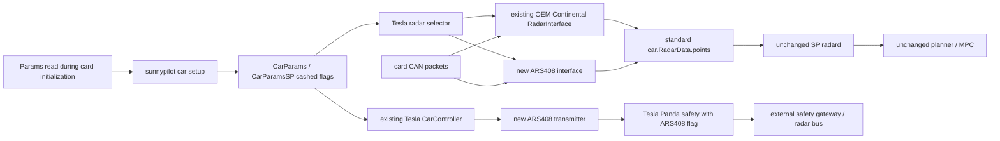
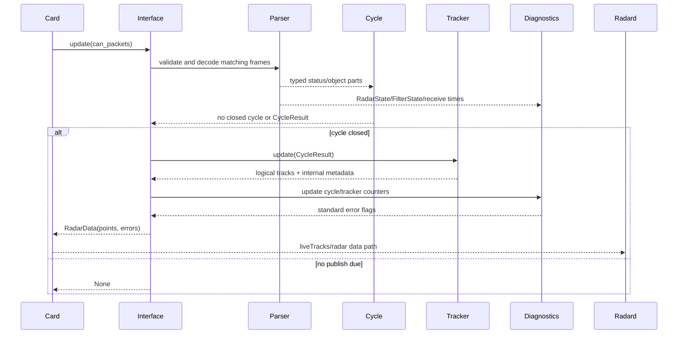

# Tesla ARS408 low-intrusion refactor design

Status: draft for review. This document describes a future implementation; only documentation is changed in the current phase.

## 1. Design objective

Add an optional Continental ARS408 backend to SP `dev-sp08` while keeping upstream-facing Tesla files as stable as possible. The implementation is a new SP extension package, not a transplant of CP's monolithic radar interface or controller logic.

The existing Tesla OEM Continental implementation stays in `opendbc/car/tesla/radar_interface.py` unchanged. Selection occurs through one thin sunnypilot entry. Runtime ARS408 code is split into parser, cycle assembler, tracker, diagnostics, interface, and transmitter modules.

## 2. Current SP call map

Observed SP integration points:

- `card` reads a fixed initialization Param list before `get_car` returns.
- sunnypilot setup can set `CarParamsSP.flags`, `safetyParam`, `CarParams.radarUnavailable`, and the existing `CarParams.deprecated.radarTimeStep` before the radar interface and controller are instantiated.
- the existing Tesla OEM radar interface accepts `(CP, CP_SP)` and is selected from `CarInterface.RadarInterface`.
- `radard` already consumes standard `RadarData.points`; no ARS-specific schema is needed.
- Tesla Panda safety lives in the target `opendbc_repo` submodule, not in a duplicated safety file under the `panda` submodule.

## 3. Architectural rules

1. New ARS408 code lives under `opendbc/sunnypilot/car/tesla/ars408/`.
2. The official-style OEM `opendbc/car/tesla/radar_interface.py` is not edited.
3. `opendbc/car/tesla/interface.py` changes only its radar-interface import to the thin selector.
4. `opendbc/car/tesla/carcontroller.py` receives only a narrow transmitter construction and `update()` call; no ARS protocol logic enters the controller.
5. Backend selection and motion-TX enablement are immutable cached flags. Runtime modules never read Params.
6. Parser and cycle modules have no tracker policy. Tracker has no CAN decoding. Diagnostics has no point-selection side effects.
7. ARS-specific metadata remains typed internal state and rate-limited logs.
8. OEM mode instantiates the existing OEM class itself, rather than emulating or wrapping its behavior.
9. No `radard`, planner, MPC, or global schema modifications are planned.

## 4. Module responsibilities and contracts

### 4.1 `constants.py`

Owns independently declared protocol constants and policy thresholds:

- Sensor ID 0, bus 1, 250 m;
- RX/TX address and DLC maps;
- probability, corridor, duplicate, handover, grace, and timeout limits;
- enum types for backend, measurement state, dynamic property, output type, and rejection reason.

No Params, CAN parser, mutable state, or logging.

### 4.2 `models.py`

Typed dataclasses used across modules, for example:

- `ObjectGeneral`, `ObjectQuality`, `ObjectExtended`;
- `AssembledObject`;
- `CycleResult` with advertised count, component counts, completeness, and rejection counters;
- `TrackState` with raw ID, logical ID, last object, miss count, and ever-measured state;
- `RadarStateSnapshot` and `FilterStateRecord`;
- `DiagnosticsSnapshot`.

All constructors validate integer ranges and finite numeric values. These types are internal and never alter Cap'n Proto.

### 4.3 `parser.py`

Responsibilities:

- own the minimal ARS408 `CANParser` instance;
- accept only bus 1 and exact address/DLC pairs;
- map DBC values into typed component records;
- decode RadarState and FilterState records;
- expose parser validity and receive timestamps.

It does not decide whether an object is usable, maintain cycles, allocate IDs, or create `RadarPoint` objects.

### 4.4 `cycle.py`

Responsibilities:

- use `0x60A` as cycle boundary;
- collect General, Quality, and Extended parts by raw ID;
- detect duplicate/missing/malformed components;
- build exact or salvageable `CycleResult` values;
- prevent data from different cycles from being merged;
- never retain stale Quality or Extended values.

It does not apply probability, static-object, identity, or fault policy.

### 4.5 `tracker.py`

Responsibilities:

- apply numeric and semantic acceptance gates;
- apply new/existing probability hysteresis;
- implement prediction constraints and measured state;
- retain tracks for two missed cycles;
- allocate never-reused logical IDs;
- transfer logical identity during explicit or unambiguous kinematic handover;
- suppress new overlapping duplicates;
- return standard point data plus an internal metadata snapshot.

It receives assembled objects and monotonic cycle numbers; it never sees raw CAN packets or Params.

### 4.6 `diagnostics.py`

Responsibilities:

- track status, RadarState, and FilterState freshness independently;
- map faults/configuration to standard `RadarData.Error` fields;
- store current RadarState and per-index FilterState internally;
- aggregate raw count, classes, probability buckets, rejection reasons, handovers, duplicates, and grace-held tracks;
- emit state-change and periodic rate-limited `carlog` records.

It uses monotonic timestamps. Logging failure cannot affect radar output.

### 4.7 `interface.py`

Responsibilities:

- subclass `RadarInterfaceBase` with the standard `(CP, CP_SP)` constructor;
- coordinate parser → cycle → tracker → diagnostics;
- wait for RadarState readiness before publishing points;
- convert tracker outputs into standard `structs.RadarData.RadarPoint` fields;
- publish standard errors and return timing compatible with card/radard.

This is an orchestrator, not a second implementation of the other modules.

### 4.8 `selector.py`

The selector is a thin factory:

- ARS408 flag set: return `ARS408RadarInterface`.
- OEM backend: return the existing `opendbc.car.tesla.radar_interface.RadarInterface` instance.
- Off/invalid: return a radar-unavailable base implementation.

It contains no parsing, tracking, Params reads, or output transformation. Returning the real OEM instance gives the strongest OEM regression boundary.

### 4.9 `transmitter.py`

Responsibilities:

- own the minimal ARS408 `CANPacker`;
- independently encode bounded `0x200`, `0x202`, `0x300`, and `0x301` frames;
- schedule only `0x300/0x301` at 20 Hz in v1;
- reject non-finite/out-of-policy inputs rather than clipping silently;
- emit no frame when cached ARS408 enablement or vehicle CAN validity is false.

It receives vehicle state from the existing controller. It does not read Params or implement unrelated Tesla control.

## 5. Initialization and selection sequence

1. `openpilot/sunnypilot/selfdrive/car/interfaces.py` adds `TeslaRadarBackend` to the one-time initialization key list.
2. `opendbc/sunnypilot/car/interfaces.py` parses the cached string once and applies Tesla backend policy.
3. OEM mode leaves current `CP.radarUnavailable` and DBC fingerprint behavior untouched.
4. ARS408 mode sets `CP.radarUnavailable = False`, sets the existing `CP.deprecated.radarTimeStep = 1/14`, sets `TeslaFlagsSP.ARS408_RADAR`, and sets `TeslaSafetyFlagsSP.ARS408_RADAR`.
5. Invalid/Off mode sets `CP.radarUnavailable = True` and sets only the internal `TeslaFlagsSP.RADAR_DISABLED` selector flag; it does not set the ARS408 or Panda-safety enable bits.
6. Card constructs the selector and controller after these flags are final.
7. The selector returns one backend instance for the session. The controller constructs one transmitter only for ARS408 mode.

No backend switch is possible until the next initialization.

## 6. RX runtime sequence

## 7. TX runtime sequence

1. Existing `CarController.update()` calls `ars408_transmitter.update(frame, CS)` through one narrow integration point.
2. The transmitter returns an empty list unless ARS408 was enabled at initialization.
3. Every fifth 100 Hz controller frame, it validates `CS.out.canValid`, finite `vEgoRaw`, finite yaw rate, direction, and operational bounds.
4. It returns exactly one `0x300` and one `0x301`, both on bus 1 with DLC 2.
5. Existing controller code extends `can_sends`; it does not inspect or mutate ARS payloads.
6. Panda independently requires the ARS408 safety flag and revalidates bus, DLC, reserved bits, and values.

## 8. Panda safety design

The safety implementation is feature-gated, not a global Tesla allowlist expansion.

Recommended structure:

- add `tesla_ars408_radar` initialized from a new SP safety bit;
- retain existing TX arrays for normal Tesla modes;
- add ARS motion messages only to ARS408-enabled TX arrays;
- add explicit payload checks in `tesla_tx_hook`;
- do not allow `0x200/0x202` in v1 production arrays;
- reset all ARS-specific state in `tesla_init`;
- add tests under both stock- and longitudinal-control Tesla safety classes.

Minimum negative tests:

- feature flag absent;
- wrong bus 0 or 2;
- DLC shorter/longer than 2;
- direction 3;
- nonzero reserved speed bit;
- speed above 85 m/s;
- yaw outside ±100 deg/s;
- all `0x200/0x202` frames rejected in v1;
- existing Tesla TX behavior unchanged with the flag absent.

The external gateway remains responsible for physical collision and forwarding policy. This design does not claim Panda can prevent a separate CAN node from transmitting a colliding ID.

## 9. Planned file-by-file changes

The list below is exhaustive for the proposed first implementation. Any additional production file requires a document amendment and review.

### 9.1 Documentation — current phase

| File | Action | Purpose |
|---|---|---|
| `docs/tesla_ars408_behavior_spec.md` | add | Reviewed behavioral/protocol/safety contract. |
| `docs/tesla_ars408_refactor_design.md` | add | Architecture, integration points, file list, tests, and commit plan. |

### 9.2 RX protocol and cycle assembly

| File | Action | Purpose |
|---|---|---|
| `opendbc_repo/opendbc/dbc/ARS408.dbc` | add | Independently authored minimal DBC containing only reviewed RX/TX frames and required signals. Do not import the full CP DBC. |
| `opendbc_repo/opendbc/sunnypilot/car/tesla/ars408/__init__.py` | add | Package boundary and public exports only. |
| `opendbc_repo/opendbc/sunnypilot/car/tesla/ars408/constants.py` | add | Addresses, DLCs, enums, thresholds, and immutable configuration. |
| `opendbc_repo/opendbc/sunnypilot/car/tesla/ars408/models.py` | add | Typed, validated internal records. |
| `opendbc_repo/opendbc/sunnypilot/car/tesla/ars408/parser.py` | add | CAN validation and typed decoding. |
| `opendbc_repo/opendbc/sunnypilot/car/tesla/ars408/cycle.py` | add | Cycle boundaries, part matching, exact/partial assembly. |

### 9.3 Tracking

| File | Action | Purpose |
|---|---|---|
| `opendbc_repo/opendbc/sunnypilot/car/tesla/ars408/tracker.py` | add | Hysteresis, grace, measured state, filtering, handover, logical IDs, duplicate suppression. |

### 9.4 Diagnostics and interface

| File | Action | Purpose |
|---|---|---|
| `opendbc_repo/opendbc/sunnypilot/car/tesla/ars408/diagnostics.py` | add | RadarState/FilterState, freshness, error mapping, internal statistics, rate-limited logs. |
| `opendbc_repo/opendbc/sunnypilot/car/tesla/ars408/interface.py` | add | Standard RadarInterface orchestration and `RadarData.points` mapping. |

### 9.5 Selector and initialization cache

| File | Action | Purpose |
|---|---|---|
| `openpilot/common/params_keys.h` | modify | Add typed persistent `TeslaRadarBackend` with default 0. |
| `openpilot/sunnypilot/selfdrive/car/interfaces.py` | modify | Read `TeslaRadarBackend` once in the existing initialization batch. |
| `opendbc_repo/opendbc/sunnypilot/car/interfaces.py` | modify | Convert cached selection into CP/CP_SP/safety flags; no runtime Params. |
| `opendbc_repo/opendbc/sunnypilot/car/tesla/values.py` | modify | Add ARS408 backend and safety flag bits. |
| `opendbc_repo/opendbc/sunnypilot/car/tesla/ars408/selector.py` | add | Thin OEM/ARS408/Off factory. |
| `opendbc_repo/opendbc/car/tesla/interface.py` | modify | Replace only the radar-interface import with the selector import. |

No settings UI is planned in v1. This avoids expanding the production touch surface before replay validation. The Param can be set offroad and requires restart.

### 9.6 Transmitter

| File | Action | Purpose |
|---|---|---|
| `opendbc_repo/opendbc/sunnypilot/car/tesla/ars408/transmitter.py` | add | Bounded encoders for `0x200/0x202/0x300/0x301`; periodic schedule only for motion frames. |
| `opendbc_repo/opendbc/car/tesla/carcontroller.py` | modify | Construct optional transmitter and extend its returned sends; no protocol logic. |

### 9.7 Safety

| File | Action | Purpose |
|---|---|---|
| `opendbc_repo/opendbc/safety/modes/tesla.h` | modify | Feature-gated `0x300/0x301` allowlist and strict payload checks; keep `0x200/0x202` blocked in v1. |
| `opendbc_repo/opendbc/safety/tests/test_tesla.py` | modify | Positive and negative ARS408 flag/bus/DLC/field/value tests plus default-mode regression. |

### 9.8 Unit and regression tests

| File | Action | Purpose |
|---|---|---|
| `opendbc_repo/opendbc/sunnypilot/car/tesla/ars408/tests/__init__.py` | add | Test package boundary. |
| `opendbc_repo/opendbc/sunnypilot/car/tesla/ars408/tests/test_parser.py` | add | Frame validation, decoding, Sensor ID 0, RadarState, FilterState. |
| `opendbc_repo/opendbc/sunnypilot/car/tesla/ars408/tests/test_cycle.py` | add | Exact, partial, malformed, duplicate, zero-object cycles. |
| `opendbc_repo/opendbc/sunnypilot/car/tesla/ars408/tests/test_tracker.py` | add | Every lifecycle, filtering, handover, ID, and duplicate rule. |
| `opendbc_repo/opendbc/sunnypilot/car/tesla/ars408/tests/test_diagnostics.py` | add | Timeouts, faults, config, recovery, and logging transitions. |
| `opendbc_repo/opendbc/sunnypilot/car/tesla/ars408/tests/test_interface.py` | add | Standard RadarData mapping and publication timing. |
| `opendbc_repo/opendbc/sunnypilot/car/tesla/ars408/tests/test_transmitter.py` | add | Encoders, scheduling, bounds, direction, reverse yaw, invalid-state suppression. |
| `opendbc_repo/opendbc/sunnypilot/car/tesla/tests/test_radar_selector.py` | add | OEM returns the existing implementation; ARS/Off selection and invalid fail-closed behavior. |
| `opendbc_repo/opendbc/sunnypilot/car/tesla/tests/__init__.py` | add | Explicit test-package boundary for lint and collection. |
| `openpilot/sunnypilot/selfdrive/car/tests/test_tesla_ars408_params.py` | add | One-time Param initialization, flags, and restart-latched semantics. |
| `opendbc_repo/opendbc/car/tesla/tests/test_tesla.py` | modify | Preserve existing OEM fingerprint/radarUnavailable assertions and add explicit default-backend regression. |

### 9.9 Explicitly unchanged files

- `opendbc_repo/opendbc/car/tesla/radar_interface.py`
- `openpilot/selfdrive/controls/radard.py`
- all planner and longitudinal MPC files
- `opendbc_repo/opendbc/car/car.capnp`
- global `openpilot/cereal` schemas
- the `panda` submodule

## 10. Test design by requirement

| Requirement | Primary tests |
|---|---|
| new/existing probability thresholds | tracker tests at codes 1, 2, and 3 |
| two-cycle loss grace | measured → two predicted outputs → deletion on third miss |
| measured semantics | states 1/2/5 true, state 3 false, retained miss false |
| predicted constraint | new state-3 rejection; established state-3 acceptance |
| raw-ID handover | explicit 4→5 merge, unique kinematic replacement, ambiguous refusal |
| logical ID continuity/no reuse | handover continuity and expired raw-ID allocation >=256 |
| duplicate suppression | established/new overlap, two-new ranking, two-established preservation |
| static/crossing filtering | corridor boundaries, stopped lead, roadside object, adjacent lane |
| RadarState | every fault, critical/advisory config, grace, recovery, missing state |
| FilterState | Header, indices 0..14, type/index/range rejection, state change |
| standard output | exact RadarPoint fields; no schema additions |
| init-only Params | fake Params read-count assertion and no Params dependency in runtime modules |
| OEM no regression | selector returns current OEM class and existing Tesla tests remain unchanged |
| TX safety | backend flag, bus, DLC, reserved bits, direction, speed/yaw boundaries |

## 11. Commit sequence

No cherry-pick is used. Each step is independently authored and reviewed.

Because `opendbc_repo` is a Git submodule, feature commits are first made inside that repository; the SP superproject records the corresponding submodule pointer in the matching logical commit.

1. **docs** — add only the two reviewed documents.
2. **RX** — minimal DBC, constants/models, parser, cycle assembler, and their focused tests.
3. **tracking** — tracker and lifecycle tests.
4. **selector** — diagnostics/interface, initialization cache, selector, standard output tests, and OEM regression tests. If desired, diagnostics can be a separate commit before selector, but it must not be hidden inside tracking.
5. **TX** — transmitter, narrow controller hook, and transmitter tests.
6. **safety** — ARS-specific safety flag, strict operational TX policy, and safety tests.
7. **tests** — cross-module fixtures, replay harness, and any missing regression-only tests; no production behavior should first appear here.

If the requested labels must be exactly `docs`, `RX`, `tracking`, `selector`, `TX`, `safety`, `tests`, diagnostics and interface are included in `selector` after their standalone unit tests are green.

## 12. Integration and update cost

Upstream-sensitive production edits are limited to:

- one import in Tesla `interface.py`;
- a small optional transmitter hook in Tesla `carcontroller.py`;
- one initialization call and flag definitions in sunnypilot extension files;
- one typed Param entry/list item;
- feature-gated Tesla safety additions.

All protocol and algorithm churn stays in new SP extension modules. When official Tesla OEM radar code changes, its file can update normally; the selector regression test verifies that default mode still returns that implementation.

## 13. Stop conditions during implementation

Stop and return to design review if any of the following occurs:

- current `dev-sp08` or its submodules advance after implementation begins;
- ARS408 requires a global RadarData schema change;
- standard SP radard cannot consume the output in replay;
- the external gateway maps the radar to a bus other than logical bus 1;
- capture shows Sensor ID other than 0 or shifted addresses;
- motion input needs a source not available in standard CarState;
- Panda cannot enforce the proposed field/value policy without weakening existing Tesla safety;
- additional production files beyond section 9 become necessary.

At such a boundary, do not silently expand scope. Update the behavior/design documents with evidence and obtain review first.
